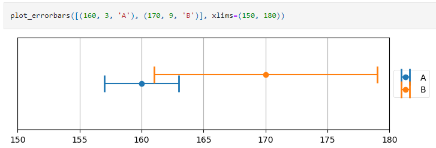
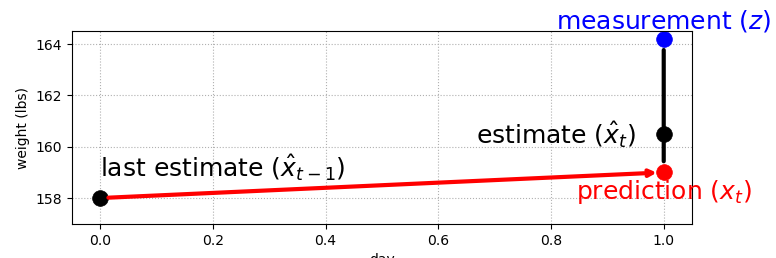
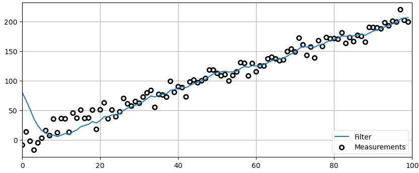
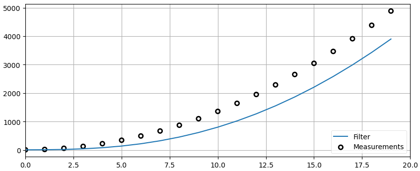
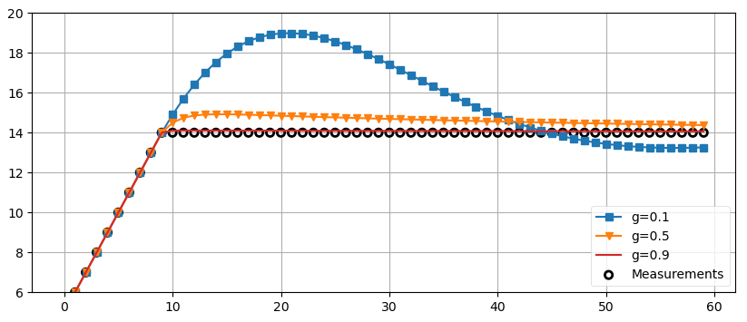

## The g-h Filter
- Intuitive introduction to the g-h filter, also known as the Alpha-&Beta Filter, which is a family of filters that includes the Kalman filter. Once you understand this chapter you will understand the concepts behind the Kalman filter.

- [Chapter 1 Notebook](https://github.com/rlabbe/Kalman-and-Bayesian-Filters-in-Python/blob/9e3d2f6ed023d937587cf2ef2ecfbf7afc3d8054//01-g-h-filter.ipynb)

## Points to remember
- Sensors are noisy, inaccurate
- 2 sensors even if inaccurate, is important.
- When there are two data sources of the same quantity with each having eq probability of giving values above and below ground truth, then actual value lies b/w 2 errorbars of datasources **ERROR BAR CONCEPT**

- Prediction step (domain knowledge) is important. (Pg: 28 trend plots)
- **Residual concept in gh filter** (Pg:30)

- Pg:33 (Top plot), Pg 31-32 basic filter (static process model_o/p = weighted sum of residual and predictions)
- Pg:34 (Process model is updated based weighted sum nof Predictions) on residual). Never trust too much on predictions
- Pg:35 (g-h filter) **g = how much residual affects final o/p. h= how much residual affects process model (↓ values, means we're confident in process model, eg if we're using CV model but CA is actual model, then >> compared to CV).**
- Pg:37 Cases where we can trust prediction / measurement
- Pg:39 g-h filta solution. Pg:40 white noise
- Pg:48 Bad Inital estimate causes Ringing (large noise in data)

**Bad Inital estimate**

- Pg:43 Difference b/w actual process model and filter model

**Difference b/w actual process model and filter model**

- Pg:44 Varying g, >g more trust in measurement, we react more to model state change. If g is too small, we might reject even state change as noise. 

**Effect of using small g**

- Pg:46 Varying h, >h we can respond to transient change
- Pg:48 (h=0, g=0) means we ignore measurements
- Ultimately g and h values selection involve tradeoff b/w how quickly we respond to measurements and how accurate we're