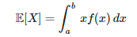
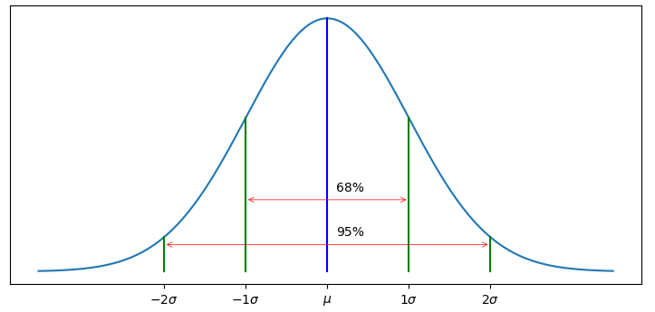

## Probabilities, Gaussians, and Bayes' Theorem
- Introduces using Gaussians to represent beliefs in the Bayesian sense. Gaussians allow us to implement the algorithms used in the discrete Bayes filter to work in continuous domains.
- [Chapter 3 Notebook](https://github.com/rlabbe/Kalman-and-Bayesian-Filters-in-Python/blob/master/03-Gaussians.ipynb)

## Points to remember
- Goal of chapter is to have basis of filter to be continous, unimodal (applicant to many tracking, filtering problems)
-Pg:88, **Random variable (RV), if O/P of event has multiple outcomes each with own prob, it constitute an RV. (Discrete/ cont. based on sample. 
- Pg:89-90 **Measure of central tendency (mean, median, mode)**
- Pg:90 E[X] = Expected vales of Random variable average Value on infinite no. of trials. If all values have equal, Prob then E[x] = mu[x]

- Pg:92- Var[x] = how much values are for from mean. Variation among values themselves. Variance is affected by outliers.
- Pg:93 68% of values lies within (mu ± 1sigma)

- Pg:96 = why square of diff. when computing Var[x](Gauss said it, little arbitary)

- Pg:97=> Gaussian = good solution (Summary stats with just mu and sigma). pdf = prob.denstly function (likelihood for RV to take a a value)

- Pg:99 intro to Gauss distributuions - continous, efficient, easy to work with, nice math properties. f(x) proportional to e^-x2

- Pg:101 => AUC for Gaussian = probability that x is between 2 values. CDF introduction
- Pg:103 1/Tau = Precision. 68-95-99.7 rule

- Pg:109-110 : p(z) generally difficult to compute analytically. Why Bayes theorem?

- Pg:114 Student t distribution used to test Gaussian filters for real world noise
- Pg:112 Gaussian limitations
- Pg:115 5sigma vs 3sigma consideration (experimental), skew, kurtosis
- Pg:116-117 Sum, Product of Gaussian results, summary

