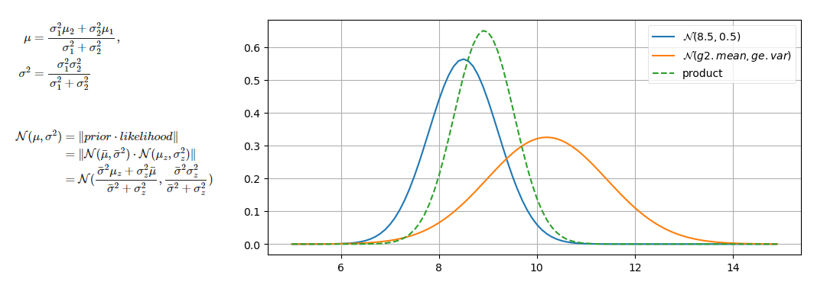
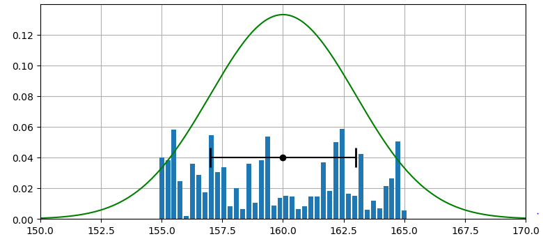

## One Dimensional Kalman Filters](Chapter4_summary.md)
- Implements a Kalman filter by modifying the discrete Bayes filter to use Gaussians. This is a full featured Kalman filter, albeit only useful for 1D problems.
- [Chapter 4 Notebook](https://github.com/rlabbe/Kalman-and-Bayesian-Filters-in-Python/blob/master/04-One-Dimensional-Kalman-Filters.ipynb)

## Points to remember
- Goal: intuition behind ID Kalman filters
- Conditions : Prediction must have Gaussian noise, Meas noise -Gauss, Meas must not be
correlated with time (Pg: 121, zero mean with some std. dev) 
- **Belief in state modelled as Gaussian**
- Pg:123 - In prediction stop, assuming 1D tracking (CV), uncertainty in velocity (movement) added to position uncertainty 
- Pg:124 Update step - Gaussian multiplication (variance is reduced, weighted average of means)

- Pg:132 - Process noise intuition, sigma, -> 3sigma=99.7%
- Pg:135 KG intuition. posterior is weighted sum of prior & likelihood
- Pg:137 KF pseudocode.
- Pg:139 - Why Gaussian > uniform for sensor modelling
- Pg:140 - Discrele vs uniform vs Gaussian distribution. Discrete dieribution provides powerful way to model any arbitary distribelton But using that for practical purpose difficult. (intractible

- Difficult to analyse discrete distribution
- Pg:141 - Sensor meas. noises application dependent
- Pg:142  Understanding spec sheets is important. (Good quality sensors -> manufacturers do some prior testing, manufacturers specify values in specsheets).
- **Pg:143-146. main cases to test -Incorrect Process noise, Too much mas noise, Bad initial estimate, Bad initial estimate + too much noise**
- Pg:151, sample performance of linear filter  in NL model. Fired gain filter = hard code KG for embedded applications