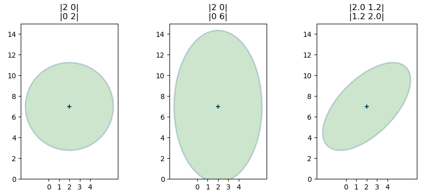
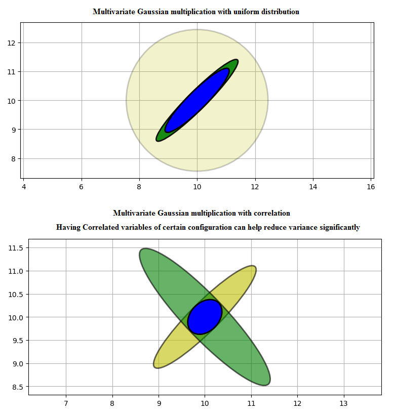
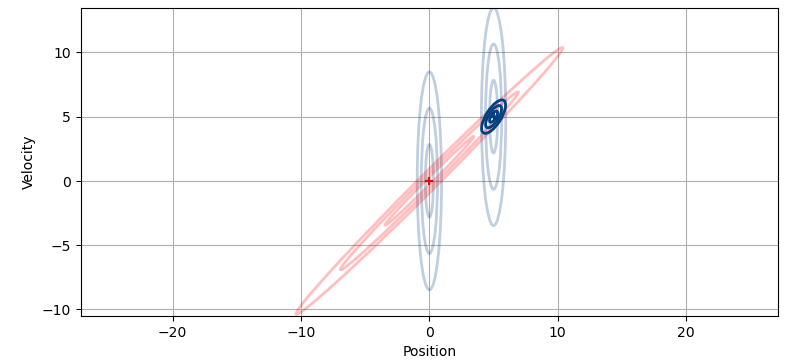

## Chapter 5: Multivariate Gaussians
- Extends Gaussians to multiple dimensions, and demonstrates how 'triangulation' and hidden variables can vastly improve estimates.
- [Chapter 5 Notebook](https://github.com/rlabbe/Kalman-and-Bayesian-Filters-in-Python/blob/master/05-Multivariate-Gaussians.ipynb)

## Points to remember
-  Multi variate Gaussians captures relationship b/w state variables
- Pg:156, Correlation & Covariance.
- Pg:157-158 Cov math formula, how it generalises to variance. Example calculation (covariance)
- Pg:159 - use of (n-1) variance formula. [population vs sample]
- Pg:160-161 -> +ve, -ve and no correlation (untilled ellipse in 2D)

- Pg:162 To find Prob. of being at a point, we integreate surface to calculate volume (2D joint Probabilly)
- Pg:163 joint vs marginal Probability (Pg:164 sample plot, cut section view)
- Pg:171 Pearson correlation coefficient
- Pg:174 - Tracking aircraft using 2 radars uniform distribution (1 sensor update covariance reduces) But and orthogonal sensor: Better ↓ in Variance (consider sensor geometry too) as same direction Sensor would have given lesser reduction in covariance

- Pg:178 - Correlation can increase our knowledge of hidden variables. We introduce correlation using F,Q matrices. KF understands this and tries to infer correlation form F, Q
- Pg:181-182. Assuming CV model = prior (prediction) => correlated. But 2D Position measurement update is uncorrelated. Together they help in reducing Cor. (Whys and hows in Pg:182)

