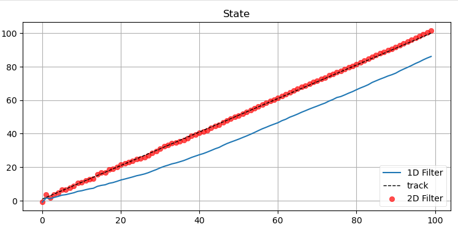

## Multivariate Kalman Filter
- We extend the Kalman filter developed in the univariate chapter to the full, generalized filter for linear problems. After reading this you will understand how a Kalman filter works and how to design and implement one for a (linear) problem of your choice.
- [Chapter 6 Notebook](https://github.com/rlabbe/Kalman-and-Bayesian-Filters-in-Python/blob/master/06-Multivariate-Kalman-Filters.ipynb)

## Points to remember
- Pg:187 - Gaussians everywhere core concept of KF
- Pg:188 - **Designing KF means to decide (X, P, F, Q, Z, R, B, U)**
- Step1: Designs State variables. Try to include correlation. But its a design choice. 
- Step2: Process model -> KF predicts state after discrete timestep. Pg:193 eg: [500 0; 0 49]  becomes [512.35 24.5; 24.5 49] when running 5 iterations of predict() using CV model. Observe correlation introduction and no change in velocity.
- Step3: process noise: White noise (zero mean and variance Q=E[w * w.Transpose()].Here Discrete white noise considered. -)
- Step4: Designing control input (u). delta state = Bu.
- Step5: Measurement function (Residual calculated update stop done in measurement space) Pg:196
- Step6: Meas. noise difficult to find correlation b/w sensors, also not Gaussian always
- Pg:199-201 Simple CV KF using filterpy objects
- Pg:202 Plot covariance of estimate. It's uncertainty we have, assuming we tell the truth
- Pg:203 saver class.
- Pg:206 Process Noise, concept of projecting P to F. Pg:207, how in cv model, vel doesn't change (height of ellipse no change, only tilting due to cordation)
- Pg:209-210, System uncertainty (S=H*P*H.T + R) projecting to meas. space similarities b/w `P` update and `S`
- Pg:210 `KG (0-1) range`, `KG~PHT`, scale/weight b/w to prediction & measurement. HT = converts from measurement Space to state space Pg:215. Effect of including velocity in state vector allows to model changing velocity, else it will not react to state change

- Pg:216 In localisation we know control I/P. **But for tracking include, V. So that I can model / try to predict changes in using correlation in model** 
- Pg:217 `KG going down is good sign of convergence, so is decreasing residual and variance (P_est)`

- Pg:218-226 - Effect of tuning different variables
    - Q↑ -> less trust in prediction, closely follow measurements
    - Less Q -> more trust in prediction, can lead to ignoring measurements.
    - **>> R causes KF to ignore measurements. Can give smooth results, but not stable. Bad initial estimate can cause it to diverge** Check for P_est Value. 
    

    - Decent R values helps KF recover even in bad initial estimate
    

    - Pg:221-222, effect of P (Higher P means more trust in measurements, Lesser P means ignores measurements,  P_est might not converge). **When Tracking dynamic objects, having >> P is justified as mrre uncertainty in movement**
    - Pg:225-226, difference b/w high R and low R. if we lie to KF that R», then it will trust prediction more (can introduce More correlation)
    - Pg:228 = Batch Processing feature. Pg:229: **Plot residual must be centered around 0 and like noise**
    - Pg:229 RTS smoother, Pg:30, Pros of using smoother
- Pg:232 - KF can be used to track higher Order derivatives. **Reality of tuning R, Q values is bit of art and science**