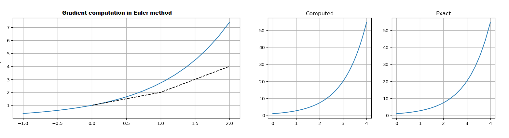
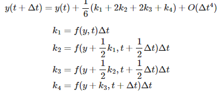
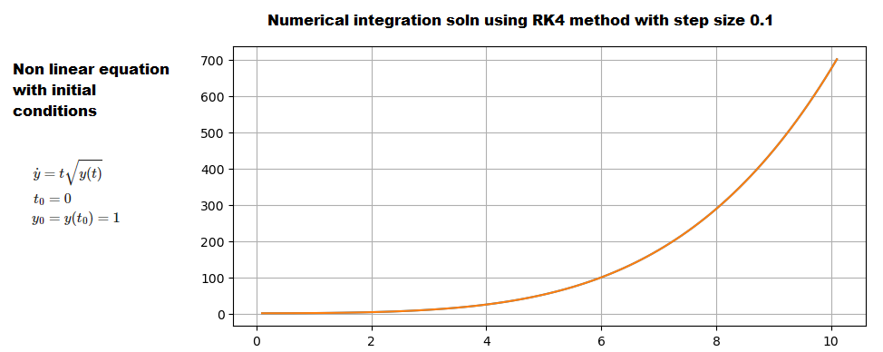

## Kalman Filter Math
- To write robust, numerically stable filters, or to read the literature, you will need to know the mathematical foundations of Kalman filter. Some sections will be required to understand the later chapters on nonlinear filtering.

- [Chapter 7 Notebook](https://github.com/rlabbe/Kalman-and-Bayesian-Filters-in-Python/blob/master/07-Kalman-Filter-Math.ipynb)

## Points to remember
- Pg:236 : x(t) = x_pred(t) + noise(t)
- `x_dot = Ax(t) + Bu(t) + w` is continous ODE form of physical system where w(t) = white noise
- `x_k = F * x_k-1 + B_k * u_k` is discrete form where **F=Transition matrix**, consisting of discete linear equations
- Pg:237. Most system modele involve set of Continous ODEs. For State space approach, convert to 1st order linear equations
- Pg:239. 3. ways to find F (discrete) from A (cont). 
    - Matris exponential
    - Linear Time Invalant theory
    - numerical techniques
- Pg:239. **1.Matrix exponential:** `x_dot = Ax`, can compute for equations having analysitcal solution. `e^At` computed using Taylour series. Need to consider time invariance. eg: aircraft losing weight due to burned fuel, but negligible for certain cases
- **2. LTI system theory** Laplace Transform
- **3. Numerical solution** : Process Noise: Difficult coz we're modelling something which we have little knowledge of.

- Pg:243 Continous white noise model `x_dot=Ax + Bu + w` is  continous over time. For CA model, we assumd `a=0`. But we're modelling it using by assuming (a) changes by continous zero mean white noise. Hence delta_velocity averaged over time = 0
- Pg:244 Q = **[0 0 0; 0 0 0; 0 0 1] * phi** where phi = spectral density of white noise. Its difficult to compute analytically

- Pg:245 Piecewise White noise: (acceleration is constant b/w  timestamps and uncorrelated over time)
- `f(x) = FX + gamma * w` - where gamma = [0.5 * delta_t^2; delta_t]

- **sigma must be in range [0.5*delta_a, delta_a]**, where delta_a = maximum acceleration change b/w timestamps. (experimentally find out)
- Pg:247 Q-discrete white noisel filterpy API
- **Pg:248 Stable computation for posterior (Joseph equation)**
- Pg:251 Numerical methods for integrating ODE. Matrix exp and Laplace transform okay for simple linear ODEs. `Complex math models => numerical methods`
- `x_dot=A*x => X_k = F * X_k-1. Numerical solution using Euler & RK4 methods`
- Pg:253 Derivative @ Pt. Taylor series 1st term alone used. Simple but delta_t needs to be small to work well or non linear ODEs.
- Eg : For simple `y=y^2` equation itself, a step size of 1 causes estimates to diverge, while we need >10000 iterations to compute good estimates (< 0.005)

- Pg:254-255, RK4 standard way to integrate ODE's with example" ODES
- Runge Kutta method formula

- Runge Kutta method example for Non linear problems

- Pg:256: MDP assumption, Current state is dependent on Prev.
state and transition prob