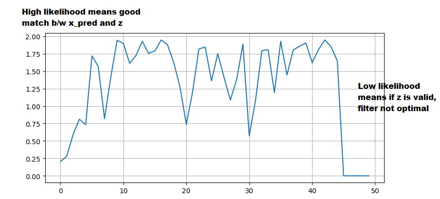

## Designing Kalman Filters
- Chaptere discusses different examples to give you a start towards implementing your own filters.Notable points on numerical stability.
- [Chapter 8 Notebook](https://github.com/rlabbe/Kalman-and-Bayesian-Filters-in-Python/blob/master/08-Designing-Kalman-Filters.ipynb)
 
## Points to remember
- Pg:262 2D Pose senser simulation (CV) model. returns x_s, z_s
- 2D Tracking problem. Pg: 262 **Step1:** Choosing state variables. List down variables of interest, using some form of mathematical expressions **(x)**

- Pg:263 **Step2:** State transition fn. Define the continous ODEs that describe the phyiscal system. (eg: CV model, CA model). Discretize the continous eqns to get state transition matrix , which helps propagate state in prediction step. **(A)**. This step can be used to introduce any known correlation

- Pg:264. **Step3:** Process noise Dicerete wiener/white noise. Choose delta_a variable for general CA, CV and related systems (uncertainty that will be added to state vector with each time period) **(Q)**.

- **Step4:** control I/P (B). If aware of control input to system, try to model that using `delta_x = B * u` form. **(B)**

- **Step5:** Measurement fn. **(H)** . This function / matrix converts the predicted state to measurement space (x -> z). 

- **Step6:** Measurement noise. **(R)**. Generally, covariance b/w sensor measurements is not known. Hence it'd be mostly diagonal matrix

- **Step7:** Initial conditions (x,P)

- Pg:268. Filter order = degree of highest form, (CA=2, CV=1). order of system = design choice. If something can travel mostly with const. vel use order=1, else it'd be bad choice
- Pg:270-272, 1st, 2nd and 0th order (ID) Tracking filter code. Pg:273 fn to Plot residual: from batch o/p data **Here Residual = diff b/w x_gt, x_est**
- **Pg:274, residual within 1sigma range, zero mean, not diverging check for each state**

- Pg:275-276. Failure of 0th order filter to model/estimate velocity changes. `Residual seems to diverge even though P_est is decreasing (converging)`

- Pg:275-276 `2nd order filter, trying to model small delta_V as acceleration, closely tracks noise in measurements, reflected in velocity residual`

- Pg:279 To counter this, if we reduce Q (less trust in measurements) -> Large lag in position residuals (diverging. cannot recover from initialisation). polyfit analogy (Pg:281 fitting parabola to st.line overfitting Adaptive filler introduction)
- similar trial using CA model, but 1st onder KF. Filler generally lags behind, for its not able to model acceleration, so if Q>>, very close to meas.noise (Pg: 284-285)
- Pg:198 Don't incorporate all measurements directly, check for outliers. Pg:290 Just checking diff b/w (x) and (z) won't work coz initially we'd have more uncertainty. Risk of losing valid measurements. Need to incorporate P also.
- Pg:291 Gating concept. `Pg:292 mahalanobis distance b/w (z,x,P) filterpy Rectangular, ellipsoidal gating`

- Pg:293: Mahalanob's dist ~ Euclidean distance but in (std.dev) terms (S^-1) to incorporate uncatainty
- Pg:294 `2 Gate approach. (Rectangular gate, Ellipsidal gate next)`
- Pg:295 Practical difficulties of Designing KF
- Pg:295 Evaluating filter performance. When we have GT (NEES) (x_err = x_gt - x_est), E = x_err.T * P * x_err -> In scalar terms, ~(x^2/P) `if P is very small, then of even for small error, E increases, E[E]=n (n=state dim] ~chi squared distribution
- Pg:296 likelihood fn: Prob & likelihood are opposite teams with different i/p and o/p. Here, its measure of how likely measurement is given, state. If likelihood = low, it measn one of our assumptions is wrong

`y=z - Hx. S = HPH.T + R.`
`Likelihood = (1 / (2*pi*S)) * exp(-1/2 * y.T * s^-1 * y) ~ exp(S/y^2)`

- Taking log on both sides, log(L) = S/y^2
- As L->0, (S/y^2) -> log(0) = inf. (either y=0  or S=inf)
- So, if likelihood is low, if valid measurements, then filter is not optimal. Log likelihood is preferred as it more numerically stable. Pg:297-298) likelihood intuition.

- Pg:299 Control I/P model change (eg steering and acc i/p)
- Pg:300-304, Wheelspeed and position sensor 2D Tracking example.
- Pg:304-308. GPS uses iterative least squares to triangulate position.
- `Commercial GPS already has KF, O/p is filter o/p. Its not advisable for us to use that in another KF as our own ilter will track filtered o/p (not actual position). Plot shows lag, smooth o/p, which are very late to react to State changes.`

- Pg:309: Non-stationary process, (delta_T) might be defferent. Reset F,Q, and last time.
- Pg:311-312. Sensor fusion different rates. Separate F,Q,H,R as per each sensor. Sample code for 2 sensors of diff, rates
- Pg:323-326. Tracking ball in atmosphere. Difficult to model non-linearities with linear filter. Tuning Q with ↑ value gives high weightage to (z) causing filter to track (z) closely. Better to use non-linear KF