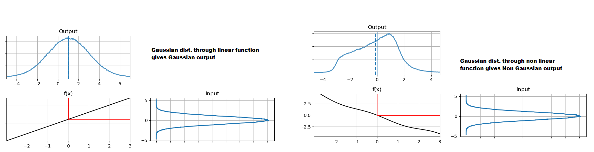
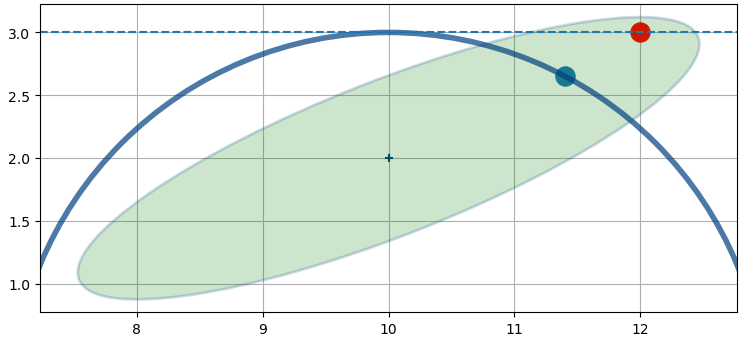

 ## Nonlinear Filtering
- Kalman filters as covered only work for linear problems. Yet the world is nonlinear. Here I introduce the problems that nonlinear systems pose to the filter, and briefly discuss the various algorithms that we will be learning in subsequent chapters.
- [Chapter 9 Notebook](https://github.com/rlabbe/Kalman-and-Bayesian-Filters-in-Python/blob/master/09-Nonlinear-Filtering.ipynb)

## Points to remember
- [Reference notbook for plotting PDFs](https://github.com/rlabbe/Kalman-and-Bayesian-Filters-in-Python/blob/master/Supporting_Notebooks/Computing_and_plotting_PDFs.ipynb)
- Pg:331 Passing points sampled from Gauss.dist through NL gives  non Gauss results. The o/p doesn't match actual mean
- Pg:332-336. Passing Gauss. dist. thru L and NL fns, comparing results. o/p is non Gaussian and diverges with each iteration

- Pg: 339-340; 1st KF version to deal with NL = EKF. Requires Jacobans (difficult to compute, might require numerical soln), possibility of diverging (difficult in high NL problems).

- Here, the non linear function is linearized, giving a horizontal line as gradient. The intersection of st.line and prior results in `red dot as position estimate` which is far off from the `actual position of blue dot`

- UKF, recent soln, easier to work implement and analyse, more stable and accurate but slower than EKF.
- `Monte-carlo methods lice Particle filters more powerful, can model arbitary fn, but analysis and operating compute resources requirement is high